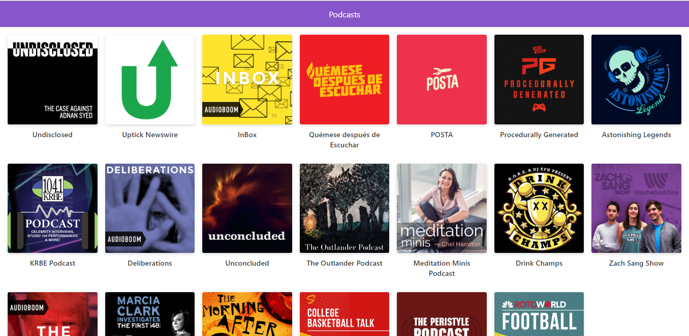

# Next.js -  App de podcast de Platzi
Curso de nextjs de Platzi para realizar una app de podcast con la API de AudioBoom.

## ¿Cómo funciona?
Requiere Node.JS 10+

* `npm install` para instalar las dependencias.
* `npm run dev` para el entorno de desarrollo.
* `npm run build && npm start` para el entorno de produccion.

## Licencia

MIT